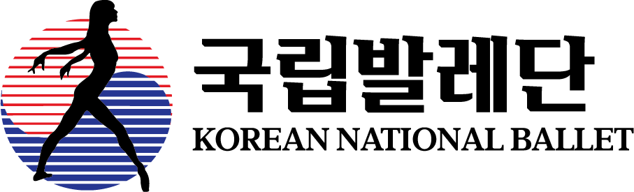

<!-- markdownlint-disable MD033 -->

<h1 align="center">국립발레단 리뉴얼</h1>

 
<!-- <h2>Intro</h2> -->

> 본 페이지는,
> **UI/UX 경험 향상**과 그에 따른 **브랜드 이미지 제고**를 목표로 제작하였습니다.  
> **모던하고 세련된 이미지**를 테마로 하여,
> 로고와 주조색, 레이아웃 디자인과 인터렉션 등을 리뉴얼하였습니다.
>  

 
<h2>Page link</h2>

아래의 링크를 통해 페이지들을 확인해보세요. :blush:  

- :small_orange_diamond: <a href="https://chkim9910.github.io/KNB-Renewal/">Main page</a>
- :small_orange_diamond: <a href="https://chkim9910.github.io/KNB-Renewal/sub1">Sub page-1 국립발레단 소개</a>
- :small_orange_diamond: <a href="https://chkim9910.github.io/KNB-Renewal/sub2">Sub page-2 공연 정보</a>
- Design with Figma <a href="https://www.figma.com/file/Cl8l0xViAvpO7k100UhVrT/%EA%B5%AD%EB%A6%BD%EB%B0%9C%EB%A0%88%EB%8B%A8?type=design&node-id=0%3A1&mode=design&t=OUFoSFTYoxJQC6MN-1">국립발레단 리뉴얼 페이지</a>  

<h2>Tool</h2>
제작에 사용된 툴과 프로그래밍 언어는 아래를 참고하세요. 
 

- **디자인툴**  
   
   
- **프로그래밍 언어**  
    
   
- **협업툴**  
  
